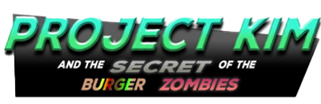
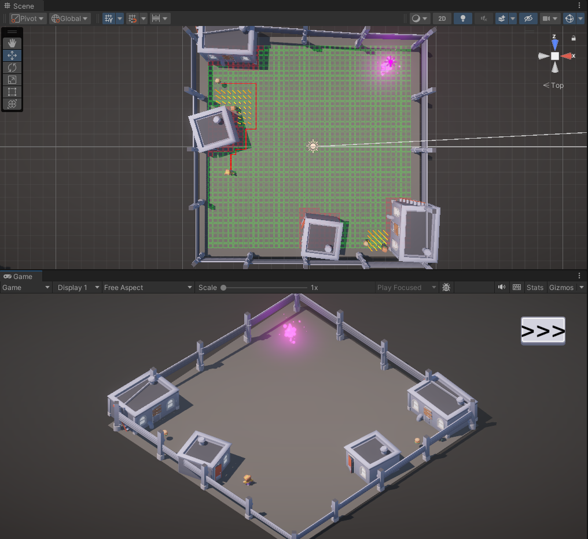
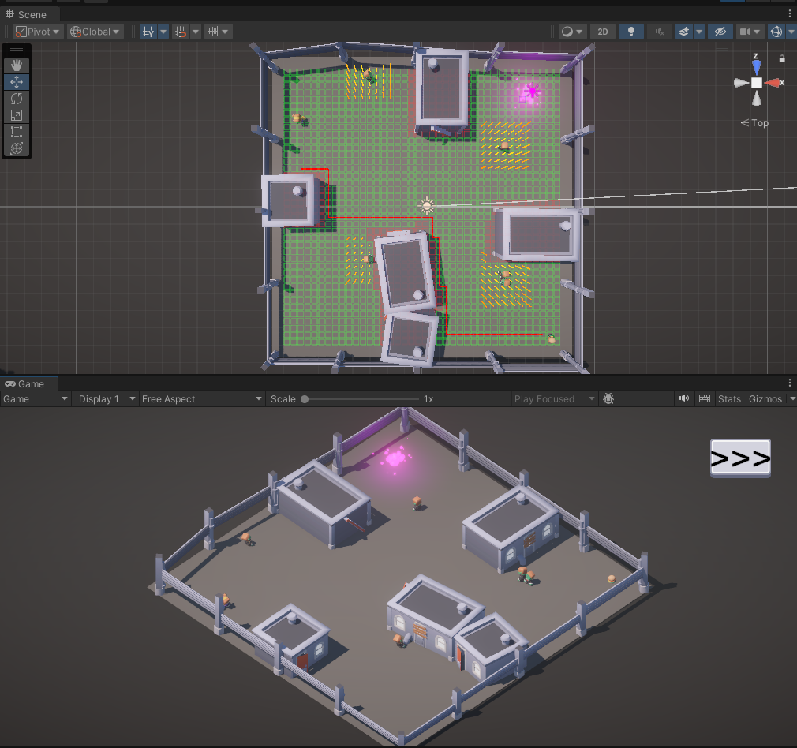
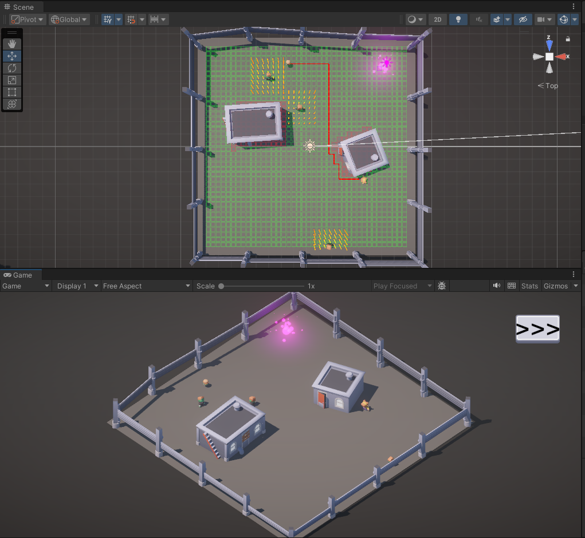
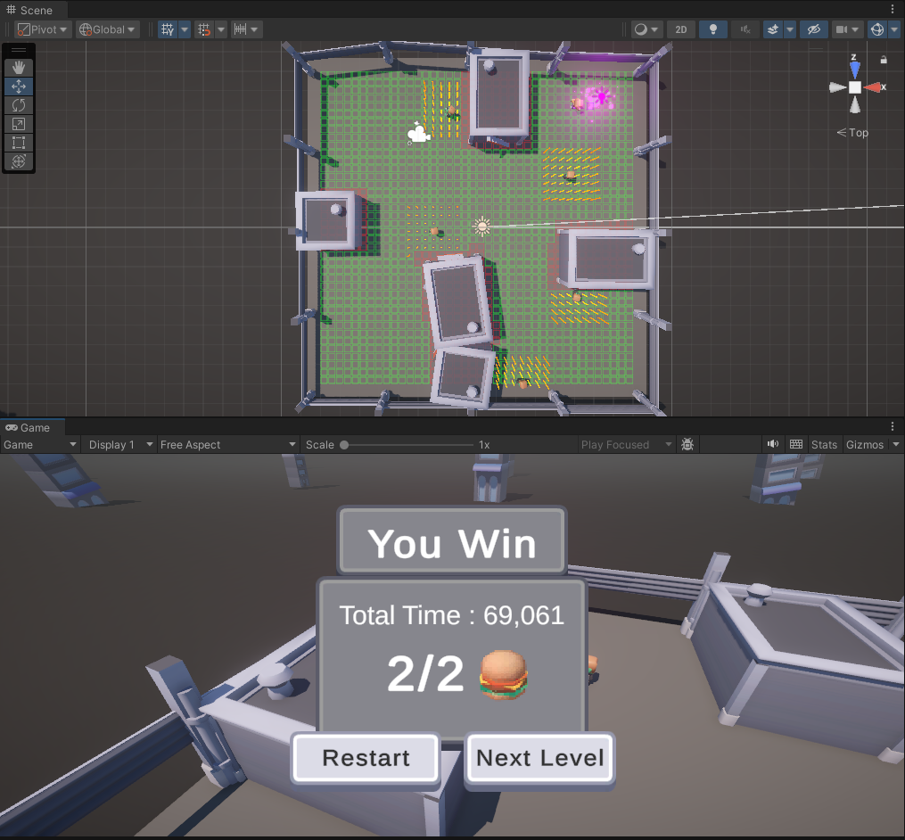

# Ai-PathFinding-Project
Game Project of Arifical Intellingent Course
<br>
- Futuregames Academy
- (7 October 2024)
- Teacher referance: <a href="https://www.linkedin.com/in/martin-andersson-20424420a?utm_source=share&utm_campaign=share_via&utm_content=profile&utm_medium=ios_app">Martin Andersson</a>

<p align="center">
  <br>
  <a href="https://kenanaegean.github.io/Lord-Of-The-Horde/">Try Game On Browser</a>
</p>

## First Assigment
### First Assigment Description
```
AI – Assignment

Intro
In order to complete the assignment, the character “Kim” will have to navigate to the
finish line, specifically in the scenes – Level1, Level2, Level3. Kim is powered by AI, that
you will have to create!
To get started - download the “AI_BaseGame” unity project on omniway. Once inside
there is a script called “Kim.cs”, This is where you implement your ai.
Note: You should not change the code base. But you can use it! Fetch tiles from the
Grid singleton for example.

G :
• Kim navigates to finish line using Dijkstra's algorithm
• Kim can avoid zombies
• Kim uses either State machine or Behavior tree

VG :
• Kim navigates to finish line using A*
• Kim can avoid zombies
• Kim can go towards burgers
• Kim uses behavior tree

Handing in
To hand in : Submit a unity project in a zipped folder to omniway. Remember to remove
the “Library” folder inside the unity project.
```

<br><b>Screenshots - First Assigment:</b>

Screenshots           |  Screenshots 
:-------------------------:|:-------------------------:
  |  
  |  

<br><b>Video - First Assigment:</b>  
<video src="https://github.com/user-attachments/assets/1362650d-4468-4e34-9784-19760b629662" width=180/></video>
